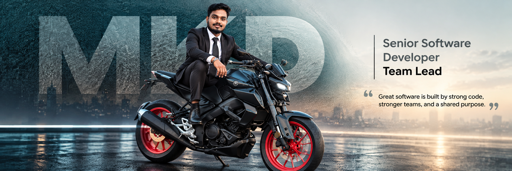
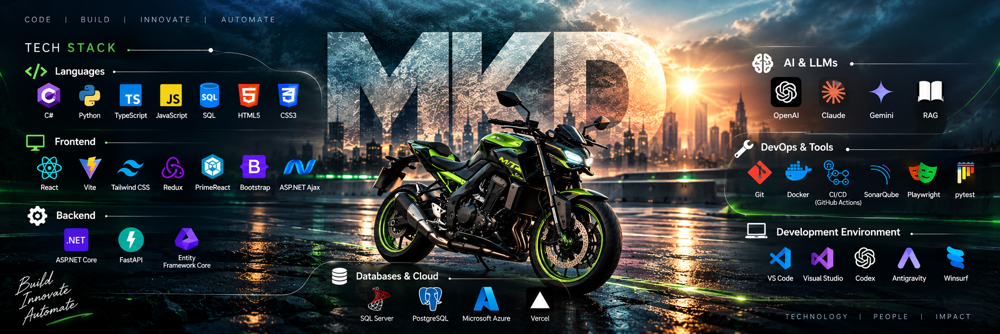

  

  

---

  <h1 style="margin-bottom: 0;">ENGINEERING IMPACT.</h1>
  <h3 style="margin-top: 5px; font-weight: normal;"><i>The intersection of robust code and visionary leadership.</i></h3>

  I’m a <b>Full Stack Developer and Team Lead</b> who turns complex business problems into scalable, high-performance software systems.

  I work across the complete engineering lifecycle — <b>architecture, backend systems, databases, APIs, frontend experiences, integrations, testing, performance, and deployment</b> — with a strong focus on building solutions that are reliable, maintainable, and built to scale.

  At <b>Aagnia Technologies</b>, I contribute to technical direction, lead development initiatives, solve complex engineering challenges, and mentor developers to deliver production-ready solutions. Beyond traditional application development, I’m actively working with <b>AI, LLMs, RAG, Agentic AI, automation, and intelligent application architectures</b> to explore how modern AI can be integrated into real-world software products.

  I believe great engineering is not about writing more code — it’s about <b>understanding the problem, designing the right solution, and building technology that creates measurable impact.</b>

 

  

    ⚡ <b>Building:</b> Full Stack Systems • AI-Powered Applications • Scalable Architectures • Intelligent Automation 
    🔭 <b>Exploring:</b> LLMs • RAG • Agentic AI • AI Integration • System Design 
    🎯 <b>Leading:</b> Engineering Teams • Technical Decisions • Product Development
  

 

  <blockquote>
    
"Think beyond the code. Engineer the solution. Build for what’s next."

  </blockquote>

 

  
  &nbsp;
  

 

---

 

  <h2 style="margin-bottom: 0;">🌐 Tech Stack & Expertise</h2>
  <h3 style="margin-top: 5px; font-weight: normal;"><i>Building reliable systems with modern technologies.</i></h3>

 

  

 

My core engineering foundation is built on [C#](https://learn.microsoft.com/en-us/dotnet/csharp/), [Python](https://www.python.org/), [TypeScript](https://www.typescriptlang.org/), and [JavaScript](https://developer.mozilla.org/en-US/docs/Web/JavaScript), driven by robust [SQL](https://en.wikipedia.org/wiki/SQL) database design. On the frontend, I craft immersive user experiences using [React.js](https://react.dev/), [React Native](https://reactnative.dev/), and [Vite](https://vite.dev/), beautifully styled with [Tailwind CSS](https://tailwindcss.com/) and state-managed by [Redux](https://redux.js.org/). My backend architecture relies heavily on high-performance frameworks like [ASP.NET Core](https://dotnet.microsoft.com/en-us/apps/aspnet) and [FastAPI](https://fastapi.tiangolo.com/), utilizing [Entity Framework Core](https://learn.microsoft.com/en-us/ef/core/) for seamless data operations across [SQL Server](https://www.microsoft.com/en-us/sql-server) and [PostgreSQL](https://www.postgresql.org/) environments. I build and deploy scalable, cloud-native solutions on [Microsoft Azure](https://azure.microsoft.com/) and [Vercel](https://vercel.com/). Currently, I am deeply focused on integrating modern AI capabilities, actively working with [OpenAI](https://openai.com/), [Claude](https://www.anthropic.com/), [Gemini](https://ai.google.dev/), [RAG](https://www.pinecone.io/learn/retrieval-augmented-generation/), and [Agentic AI](https://en.wikipedia.org/wiki/Intelligent_agent) to push the boundaries of intelligent software. To ensure flawless code quality and seamless delivery, I leverage a solid DevOps culture using [Git](https://git-scm.com/), [Docker](https://www.docker.com/), [CI/CD](https://github.com/features/actions), [SonarQube](https://www.sonarsource.com/products/sonarqube/), [Playwright](https://playwright.dev/), and [Pytest](https://docs.pytest.org/). My day-to-day development thrives in powerful environments like [VS Code](https://code.visualstudio.com/) and [Visual Studio](https://visualstudio.microsoft.com/), augmented by cutting-edge AI coding assistants such as [Codex](https://openai.com/codex/), [Antigravity](#), and [Winsurf](https://windsurf.ai/).

 

  <h2 style="margin-bottom: 0;">🧠 Future Protocol: Currently Exploring</h2>
  <h3 style="margin-top: 5px; font-weight: normal;"><i>"I am analyzing the next generation of intelligent software."</i></h3>

  
  <strong>System Input: AI/ML ➔ LLMs ➔ RAG ➔ Agentic AI ➔ Emerging Tech</strong>  
  "My primary objective is architecting systems at the absolute edge of generative intelligence. The future isn't just about writing code; it's about engineering autonomous agents that think, learn, and execute complex workflows seamlessly. I am currently decoding the architecture of tomorrow's software. You can observe my latest neural network experiments and AI integrations running live at my dedicated intelligence hub."  
  <a href="https://consistency-ai.netlify.app/"><b>✨ Access Consistency AI Lab ↗</b></a>

 

---

 

  <h2 style="margin-bottom: 0;">🔥 Top Projects & Missions</h2>
  <h3 style="margin-top: 5px; font-weight: normal;"><i>Showcasing architected solutions, intelligent systems, and scalable products.</i></h3>

 

### 🌐 01 / AI-World
> 
>   
> **AI Technology Intelligence Platform**
> A comprehensive platform to collect, organize, and surface the latest developments across AI, GenAI, Cloud, and emerging technologies.
>  
> 
>   
> <a href="https://ai-world-blue.vercel.app"><b>Explore Live Demo ↗</b></a> &nbsp; | &nbsp; <a href="#"><b>GitHub Repository ↗</b></a>

 

### 📚 02 / Everest
> 
>   
> **Learning & CRM Ecosystem**
> A large-scale education platform with student management, exams, subscriptions, tutoring, dashboards, and AI-powered learning experiences.
>  
> 
>   
> <a href="#"><b>View Project ↗</b></a> &nbsp; | &nbsp; <a href="#"><b>GitHub Repository ↗</b></a>

 

### 🤖 03 / AI Agent
> 
>   
> **Autonomous Workflow Automation**
> An intelligent automation system that transforms complex business processes into AI-assisted autonomous workflows with decision making.
>  
> 
>   
> <a href="#"><b>View Architecture ↗</b></a> &nbsp; | &nbsp; <a href="#"><b>GitHub Repository ↗</b></a>

 

### 🎙️ 04 / Elliot
> 
>   
> **AI Learning Assistant**
> A conversational AI assistant designed to provide contextual support in educational platforms with knowledge retrieval and voice capabilities.
>  
> 
>   
> <a href="#"><b>View Project ↗</b></a> &nbsp; | &nbsp; <a href="#"><b>GitHub Repository ↗</b></a>

 

### 📊 05 / Data Pipelines
> 
>   
> **Data + RAG Pipelines**
> Robust data ingestion and processing pipelines for large-scale structured and unstructured data to power Retrieval-Augmented Generation systems.
>  
> 
>   
> <a href="#"><b>View Project ↗</b></a> &nbsp; | &nbsp; <a href="#"><b>GitHub Repository ↗</b></a>

 

### 🏢 06 / Architecture Redesign
> 
>   
> **Enterprise Microservices**
> Spearheaded the migration of legacy monolithic systems into scalable, high-performance microservices for enterprise clients at Aagnia Technologies.
>  
> 
>   
> <a href="#"><b>View Case Study ↗</b></a> &nbsp; | &nbsp; <a href="#"><b>GitHub Repository ↗</b></a>

 

---

 

 

  
  &nbsp;&nbsp;&nbsp;&nbsp;
  

     

  
  &nbsp;&nbsp;&nbsp;&nbsp;
  

     

  
  &nbsp;&nbsp;&nbsp;&nbsp;
  
  
     

